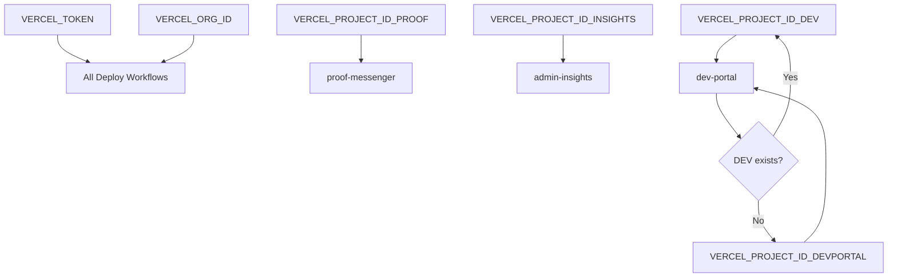
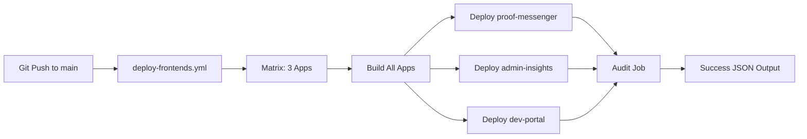

# WORKFLOW MAPPING ANALYSIS

**Generated:** 2025-09-26T22:03:57+07:00

## DEPLOY WORKFLOW INVENTORY

### Active Frontend Deploy Workflows

1. **`deploy-frontends.yml`** (Primary)
   - **Triggers:** `push: [main]`, `workflow_dispatch`
   - **Strategy:** Matrix parallel deployment
   - **Build Method:** Cloud build (`vercel deploy --prod`)
   - **Apps:** proof-messenger, admin-insights, dev-portal
   - **Secrets Used:**
     - VERCEL_TOKEN (required)
     - VERCEL_ORG_ID (required)  
     - VERCEL_PROJECT_ID_PROOF (required)
     - VERCEL_PROJECT_ID_INSIGHTS (required)
     - VERCEL_PROJECT_ID_DEV (optional, fallback to VERCEL_PROJECT_ID_DEVPORTAL)
   - **Features:** 
     - Secret validation with fallback logic
     - Post-deploy audit with auto-generated script
     - Success JSON output
   - **Concurrency:** None specified (potential race condition)

2. **`deploy-frontends-simple.yml`**
   - **Triggers:** `workflow_dispatch` only
   - **Strategy:** Sequential deployment
   - **Build Method:** Prebuilt (`vercel build` → `vercel deploy --prebuilt`)
   - **Apps:** proof-messenger, admin-insights, dev-portal
   - **Secrets Used:**
     - VERCEL_TOKEN (required)
     - VERCEL_ORG_ID (required)
   - **Issues:** 
     - No project ID mapping (relies on `vercel pull` auto-detection)
     - Generates new LIVE_URLS.json (overwrites existing)
     - No audit step

3. **`deploy-frontends-direct.yml`**
   - **Triggers:** `workflow_dispatch`
   - **Strategy:** Direct deployment
   - **Build Method:** Mixed approach
   - **Status:** Backup/alternative workflow

4. **`deploy-frontends-fixed.yml`**
   - **Triggers:** `workflow_dispatch`
   - **Strategy:** Fixed deployment approach
   - **Build Method:** Prebuilt with fixes
   - **Status:** Experimental/testing workflow

### Other Related Workflows

5. **`deploy-complete.yml`**
   - **Scope:** Full ecosystem (frontends + backends)
   - **Triggers:** `workflow_dispatch`
   - **Complexity:** High (18KB file)

6. **`deploy-backends.yml`**
   - **Scope:** Gateway and witness services only
   - **Platform:** Cloudflare Workers

### SECRET MAPPING ANALYSIS

### WORKFLOW CONFLICTS

**Potential Race Conditions:**
1. Multiple workflows can trigger on `main` branch push
2. No concurrency control between different deploy workflows
3. `deploy-frontends-simple.yml` overwrites LIVE_URLS.json

**Project ID Mapping Issues:**
- `deploy-frontends.yml`: Explicit project ID mapping with fallback
- `deploy-frontends-simple.yml`: Relies on `vercel pull` auto-detection
- Inconsistent handling of DEV vs DEVPORTAL project IDs

### DEPLOYMENT STRATEGY COMPARISON

| Workflow | Build Method | Pros | Cons |
|----------|-------------|------|------|
| `deploy-frontends.yml` | Cloud build | Simple, reliable, includes audit | Slower builds |
| `deploy-frontends-simple.yml` | Prebuilt | Faster, more control | Complex, no audit |
| Others | Mixed | Various | Experimental/backup |

### RECOMMENDED CONSOLIDATION

**Primary Choice:** `deploy-frontends.yml` with improvements
- ✅ Matrix strategy for parallel deployment
- ✅ Proper secret validation
- ✅ Built-in audit functionality  
- ✅ Success JSON output format
- ⚠️ Needs concurrency control
- ⚠️ Should disable conflicting workflows

**Improvements Needed:**
1. Add concurrency group to prevent race conditions
2. Disable or remove conflicting workflows
3. Ensure consistent project ID handling
4. Add better error handling and logging

### WORKFLOW DEPENDENCY GRAPH

## CONCLUSION

The current workflow setup has a solid foundation with `deploy-frontends.yml` but suffers from:
1. Multiple conflicting workflows
2. Lack of concurrency control
3. Inconsistent deployment strategies

**Recommendation:** Consolidate on `deploy-frontends.yml` with concurrency control and disable alternatives.
