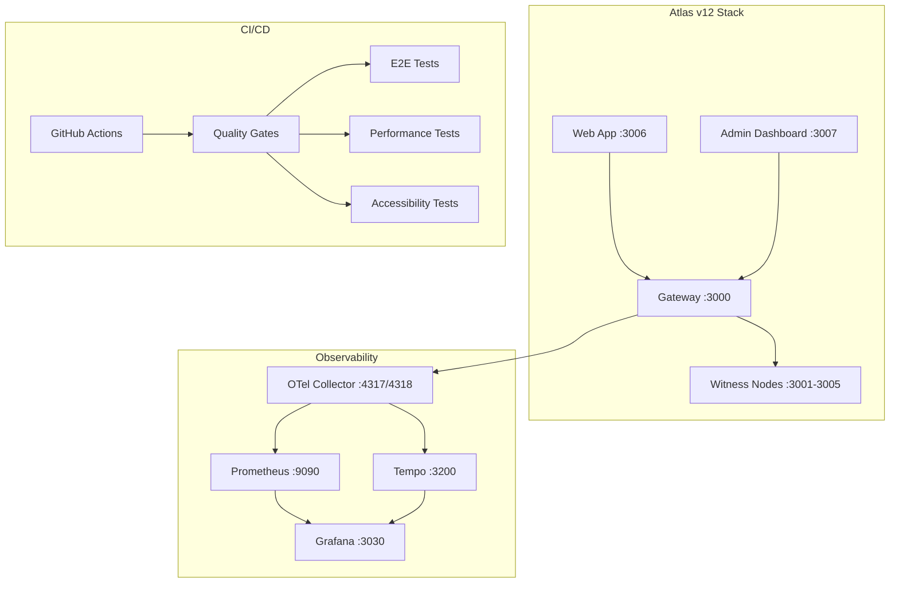

# Atlas Ecosystem — Production-only

This repository hosts the Atlas Ecosystem with Atlas Messenger as the flagship app. Two SKUs are supported:

- Basic: fast, clean, reliable
- Pro: advanced security, PQC readiness, QTCA full, multi-tenant, SSO

## What is Atlas Ecosystem (Basic vs Pro outcomes)
- Basic focuses on simple, reliable proof messaging UX with receipts and verification against the Gateway.
- Pro enables enterprise controls: multi-tenant isolation, QTCA full hooks, and PQC readiness with Ed25519 fallback.

## Production-only policy; LIVE_URLS.json + getGatewayUrl()
- No localhost. All navigation and API calls must resolve against production URLs defined in `LIVE_URLS.json`.
- Always resolve the Gateway endpoint via `packages/config/src/live.ts:getGatewayUrl()`; do not hardcode URLs.

## Post-replan layout (matches BLUEPRINT)
```
apps/
  proof-messenger/   # Next app/; Messenger UX
  admin-insights/    # Status/metrics/QTCA dashboards
  dev-portal/        # Plugins registry + SDK docs
services/
  gateway/           # Workers API; receipts/credits/QTCA
  witness*/          # evidence/ledger
packages/
  config/            # LIVE_URLS + getGatewayUrl
  design-system/     # tokens/components used
docs/
  evidence/<ts>/
  REPLAN/*
```

## Running and deploying (high-level; no localhost)
- Apps are deployed to Vercel; Workers are deployed to Cloudflare (with `compatibility_flags=["nodejs_compat"]`).
- For local validation, use read-only audits and type-checks. Do not run dev servers in this repo per policy.

## Evidence location
- Evidence artifacts live under `docs/evidence/<ts>/` and are referenced by reports in `docs/REPLAN/`.

[](https://github.com/your-org/Atlas/actions/workflows/atlas-v12-quality-gates.yml)
[](https://atlas-grafana-demo.loca.lt)

> **Next-generation secure, multi-witness data integrity platform with breakthrough innovations**

Atlas v12 delivers enterprise-grade data integrity with a distributed witness network, comprehensive observability, and breakthrough features like self-healing infrastructure and AI-native operations.

## 🚀 Quick Start

### Prerequisites

- **Node.js 20 LTS** (`corepack enable`)
- **Docker & Docker Compose v2**
- **pnpm** (preferred) or npm/yarn

### 1. Clone & Install

```bash
git clone https://github.com/your-org/Atlas.git
cd Atlas
corepack enable
pnpm install
```

### 2. Start the Stack

```bash
# Start observability stack (Prometheus, Grafana, Tempo, OTel Collector)
docker compose -f observability/docker-compose.yml up -d

# Start web application
cd apps/web
pnpm run dev
```

### 3. Access Services

| Service | URL | Purpose |
|---------|-----|---------|
| **Web App** | http://localhost:3006 | Main Atlas v12 interface |
| **Grafana** | http://localhost:3030 | Metrics & dashboards |
| **Prometheus** | http://localhost:9090 | Metrics collection |
| **Tempo** | http://localhost:3200 | Distributed tracing |

### 4. Run Quality Checks

```bash
# Run smoke tests
bash scripts/smoke.sh

# Run E2E tests
pnpm exec playwright test

# Run performance tests
k6 run tests/performance/atlas-load-test.js

# Run accessibility tests
lhci autorun
```

## 🏗️ Architecture



## 🎯 Core Features

### P0 Product Surface
- **Auth Demo**: Secure authentication with demo mode
- **API Keys**: Manage access keys with rotation & revocation
- **Ingest Playground**: Real-time data ingestion testing
- **Witness Status**: Monitor distributed witness network health
- **Metrics View**: Performance dashboards and KPIs
- **Docs Pane**: Interactive documentation and examples
- **Settings**: Comprehensive configuration management
- **Admin Dashboard**: System administration and monitoring

### Breakthrough Innovations (Feature Flags)
- **Self-Healing Infra 2.0**: Automatic failure detection and recovery
- **Zero-Friction Onboarding**: One-click setup and configuration
- **AI-Native Ops Console**: Intelligent operations and recommendations
- **Edge-Aware Ingestion**: Optimized data routing and processing
- **Local-First Dev Mode**: Offline-capable development environment
- **Policy-as-Config**: Declarative security and compliance policies
- **Chaos-as-a-Feature**: Built-in resilience testing
- **Cost & Perf Lens**: Real-time cost and performance optimization
- **Plugin Surface**: Extensible architecture for custom integrations

## 🛠️ Development

### Project Structure

```
Atlas/
├── apps/
│   ├── web/                 # Next.js web application
│   └── admin/               # Admin dashboard
├── services/
│   ├── gateway/             # Atlas Gateway service
│   └── witness-node/        # Witness node implementation
├── packages/
│   ├── fabric-client/       # Client SDK
│   └── fabric-protocol/     # Protocol definitions
├── observability/           # Observability stack
├── tests/
│   ├── e2e/                 # Playwright E2E tests
│   └── performance/         # k6 performance tests
├── .github/workflows/       # CI/CD pipelines
└── scripts/                 # Utility scripts
```

### Available Scripts

```bash
# Development
pnpm run dev                 # Start development server
pnpm run build              # Build all applications
pnpm run lint               # Run ESLint
pnpm run type-check         # Run TypeScript checks

# Testing
pnpm run test               # Run unit tests
pnpm exec playwright test   # Run E2E tests
k6 run tests/performance/atlas-load-test.js  # Performance tests
lhci autorun                # Accessibility tests

# Quality Gates
bash scripts/smoke.sh       # Smoke tests
pnpm run storybook          # Component library
```

## 📊 Quality Gates

Atlas v12 implements comprehensive quality gates:

| Gate | Tool | Threshold | Purpose |
|------|------|-----------|---------|
| **Lint & Security** | ESLint, Trivy, SBOM | Zero critical issues | Code quality & security |
| **Build & Test** | Jest, TypeScript | All tests pass | Functionality verification |
| **E2E Tests** | Playwright | 100% pass rate | User journey validation |
| **Performance** | k6 | P95 < 2s, Error rate < 10% | Load testing |
| **Accessibility** | Lighthouse | A11y score ≥ 90 | WCAG AA compliance |
| **Smoke Tests** | Custom scripts | All services healthy | System health |

## 🔧 Configuration

### Environment Variables

```bash
# Core Configuration
ATLAS_NODE_ENV=development
ATLAS_LOG_LEVEL=info
ATLAS_DEMO_MODE=true

# Observability
OTEL_EXPORTER_OTLP_ENDPOINT=http://localhost:4317
PROMETHEUS_ENDPOINT=http://localhost:9090
GRAFANA_ENDPOINT=http://localhost:3030

# Security
ATLAS_API_KEY_PREFIX=sk_live_
ATLAS_JWT_SECRET=your-secret-key
```

### Docker Compose

```bash
# Start full stack
docker compose -f observability/docker-compose.yml up -d

# View logs
docker compose -f observability/docker-compose.yml logs -f

# Stop stack
docker compose -f observability/docker-compose.yml down
```

## 📈 Monitoring & Observability

### Grafana Dashboards
- **System Overview**: CPU, memory, disk usage
- **Application Metrics**: Request rates, latency, error rates
- **Witness Network**: Node health, quorum status, attestations
- **Business Metrics**: User activity, data ingestion rates

### Prometheus Alerts
- **Service Down**: Immediate notification of service failures
- **High Error Rate**: Alert when error rate exceeds threshold
- **Performance Degradation**: Latency and throughput alerts
- **Resource Exhaustion**: CPU, memory, disk usage alerts

### Distributed Tracing
- **Request Flow**: End-to-end request tracing
- **Performance Analysis**: Identify bottlenecks and slow queries
- **Error Debugging**: Detailed error context and stack traces
- **Dependency Mapping**: Service interaction visualization

## 🚀 Deployment

### Production Deployment

```bash
# Build production images
docker compose -f infra/docker/compose.prod.yml build

# Deploy with Helm
helm install atlas ./infra/k8s/atlas

# Or deploy with Docker Compose
docker compose -f infra/docker/compose.prod.yml up -d
```

### CI/CD Pipeline

The CI/CD pipeline automatically:
1. **Lints** code and runs security scans
2. **Builds** applications and Docker images
3. **Tests** functionality with unit and E2E tests
4. **Validates** performance and accessibility
5. **Deploys** to staging/production environments
6. **Monitors** system health and alerts

## 🤝 Contributing

1. **Fork** the repository
2. **Create** a feature branch (`git checkout -b feature/amazing-feature`)
3. **Commit** your changes (`git commit -m 'Add amazing feature'`)
4. **Push** to the branch (`git push origin feature/amazing-feature`)
5. **Open** a Pull Request

### Development Guidelines

- Follow [Conventional Commits](https://conventionalcommits.org/)
- Write tests for new features
- Ensure all quality gates pass
- Update documentation as needed
- Follow the [Code of Conduct](CODE_OF_CONDUCT.md)

## 📚 Documentation

- **[API Reference](docs/api.md)** - Complete API documentation
- **[Operations Guide](OPERATIONS.md)** - Deployment and operations
- **[Runbook](RUNBOOK.md)** - Troubleshooting and maintenance
- **[Security Guide](SECURITY.md)** - Security best practices
- **[Changelog](CHANGELOG.md)** - Release notes and updates

## 🆘 Support

- **Documentation**: [docs.atlas.dev](https://docs.atlas.dev)
- **Community**: [Discord Server](https://discord.gg/atlas)
- **Issues**: [GitHub Issues](https://github.com/your-org/Atlas/issues)
- **Email**: support@atlas.dev

## 📄 License

This project is licensed under the MIT License - see the [LICENSE](LICENSE) file for details.

## 🙏 Acknowledgments

- Built with [Next.js](https://nextjs.org/)
- Observability powered by [Grafana](https://grafana.com/), [Prometheus](https://prometheus.io/), and [OpenTelemetry](https://opentelemetry.io/)
- Testing with [Playwright](https://playwright.dev/) and [k6](https://k6.io/)
- UI components with [Radix UI](https://www.radix-ui.com/) and [Tailwind CSS](https://tailwindcss.com/)

---

**Atlas v12** - Secure, scalable, and intelligent data integrity for the modern world.