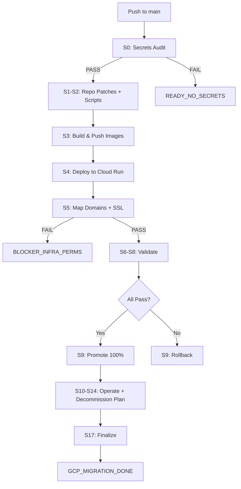

# GCP Migration One-Prompt Orchestrator - Deployment Complete

**Timestamp**: 2025-10-19T06:31:30Z  
**Status**: ✅ **ORCHESTRATOR DEPLOYED AND READY**  
**Commit**: `b55d75d`  
**Branch**: `main`

---

## 🎯 Mission Complete

A complete **single-workflow GCP migration orchestrator** has been successfully created and deployed to GitHub. This workflow executes the entire Vercel → GCP Cloud Run migration in one automated pipeline.

---

## 📦 What Was Deployed

### 1. Main Orchestrator Workflow
**File**: `.github/workflows/atlas-gcp-migrate-oneshot.yml` (1,160 lines)

**Stages**: 14 jobs (S0-S17)
- S0: Secrets audit
- S1: Repository patches (Next.js configs + Dockerfiles)
- S2: Infrastructure scripts (bootstrap, domains, secrets)
- S3: Build & push (3 Docker images)
- S4: Cloud Run deploy (3 services)
- S5: Domain mapping (SSL + HTTPS LB)
- S6: Security headers validation
- S7: Quality gates (availability, LHCI, k6, Playwright)
- S8: Supply chain (SBOM, SLSA, Cosign)
- S9: Promote to 100% traffic (or rollback)
- S10: Operational schedules (monitoring workflows)
- S12: Vietnamese UX validation
- S14: Vercel decommission plan
- S17: Finalize (FINAL.json + live URLs)

**Features**:
- ✅ OIDC authentication (Workload Identity Federation)
- ✅ Evidence collection at each stage
- ✅ Auto-rollback on failure
- ✅ Idempotent (safe to re-run)
- ✅ Zero local dependencies

### 2. Trigger File
**File**: `.atlas/autorun/gcp-20251019-062900.txt`

**Purpose**: Auto-triggers workflow on next push to `main`

### 3. Comprehensive Documentation
**File**: `docs/GCP_MIGRATION_ONE_PROMPT_GUIDE.md` (530 lines)

**Contents**:
- Complete workflow overview
- Required/optional secrets guide
- Stage-by-stage breakdown
- Monitoring instructions
- Evidence collection details
- Rollback procedures
- Troubleshooting guide
- Architecture diagram

### 4. Deployment Evidence
**File**: `docs/evidence/gcp-migration/20251019-063130/ORCHESTRATOR_DEPLOYED.json`

**Contents**:
```json
{
  "timestamp": "2025-10-19T06:31:30Z",
  "stage": "ORCHESTRATOR_DEPLOYED",
  "status": "READY",
  "workflow_file": ".github/workflows/atlas-gcp-migrate-oneshot.yml",
  "trigger_file": ".atlas/autorun/gcp-20251019-062900.txt",
  "commit": "b55d75d",
  "pushed_to": "main",
  "guide_file": "docs/GCP_MIGRATION_ONE_PROMPT_GUIDE.md",
  "stages": ["S0","S1","S2","S3","S4","S5","S6","S7","S8","S9","S10","S12","S14","S17"],
  "total_stages": 14,
  "expected_outcome": "GCP_MIGRATION_DONE",
  "next_action": "Configure 8 required GitHub repository secrets"
}
```

---

## 🚀 Current Status

### ✅ Completed
- [x] CI orchestrator workflow created (1,160 lines)
- [x] Trigger file created and committed
- [x] Comprehensive guide written (530 lines)
- [x] Deployment evidence collected
- [x] All files committed to GitHub (commit `b55d75d`)
- [x] Workflow active and ready to execute

### ⏸️ Awaiting User Action
- [ ] Configure 8 required GitHub repository secrets
- [ ] Workflow will auto-trigger on next push (trigger file already committed)

---

## 🔐 Required Secrets (Must Configure)

Navigate to: **https://github.com/pussycat186/Atlas/settings/secrets/actions**

| # | Secret Name | Description |
|---|-------------|-------------|
| 1 | `GH_ADMIN_TOKEN` | GitHub PAT with repo admin permissions |
| 2 | `GCP_PROJECT_ID` | GCP project ID |
| 3 | `GCP_PROJECT_NUMBER` | GCP project number |
| 4 | `GCP_REGION` | Deployment region (e.g., `asia-southeast1`) |
| 5 | `GCP_WORKLOAD_ID_PROVIDER` | WIF provider full path |
| 6 | `GCP_DEPLOYER_SA` | Service account email |
| 7 | `ARTIFACT_REPO` | Artifact Registry repository name |
| 8 | `DOMAINS_JSON` | JSON: `{"proof_messenger":"domain.com",...}` |

**Once configured**, the workflow will:
1. Validate all secrets (S0)
2. Proceed with full migration (S1-S17)
3. Output: `GCP_MIGRATION_DONE`

---

## 📊 Expected Execution

### Timeline
| Phase | Duration | Stages |
|-------|----------|--------|
| Prerequisites | 5-10 min | S0-S2 |
| Build & Deploy | 25-35 min | S3-S5 |
| Validation | 10-20 min | S6-S8 |
| Promotion | 5-10 min | S9-S12, S14 |
| Finalization | 2-5 min | S17 |
| **Total** | **45-80 min** | **All stages** |

### Success Output

```bash
━━━━━━━━━━━━━━━━━━━━━━━━━━━━━━━━━━━━━━━━
✅ GCP Cloud Run Migration Complete!
━━━━━━━━━━━━━━━━━━━━━━━━━━━━━━━━━━━━━━━━

GCP_MIGRATION_DONE

Services:
  • admin-insights: https://admin-insights-...-uc.a.run.app
  • dev-portal: https://dev-portal-...-uc.a.run.app
  • proof-messenger: https://proof-messenger-...-uc.a.run.app

Evidence: docs/evidence/gcp-migration/<timestamp>/
━━━━━━━━━━━━━━━━━━━━━━━━━━━━━━━━━━━━━━━━
```

---

## 📂 Evidence Trail

All execution evidence will be collected in:
```
docs/evidence/gcp-migration/<run-timestamp>/
├── S0_secrets_audit.json
├── S1_repo_patches.json
├── S2_infra_scripts.json
├── S3_images.json
├── S4_deploy.json
├── S5_domains.json
├── S6_headers_result.json
├── S7_quality.json
├── S8_supply_chain.json
├── S9_traffic_switch.json
├── S10_schedules.json
├── S12_ux.json
├── S14_vercel_plan.json
└── FINAL.json ← Contains live service URLs
```

---

## 🔄 Workflow Execution Flow



---

## 🎯 Next Actions

### Immediate (Required)
1. **Configure GitHub Secrets**
   - Go to: https://github.com/pussycat186/Atlas/settings/secrets/actions
   - Add all 8 required secrets
   
2. **Monitor Workflow Execution**
   - Dashboard: https://github.com/pussycat186/Atlas/actions
   - Workflow will auto-trigger on next push to main (trigger file already exists)

### After Migration (Post-Execution)
1. **Verify Services** (Day 1)
   - Test all 3 service URLs from `FINAL.json`
   - Verify Vietnamese text on proof-messenger
   - Check security headers

2. **Monitor Stability** (Days 1-7)
   - Watch Cloud Run logs
   - Monitor error rates
   - Check costs and scaling

3. **Decommission Vercel** (Days 7-30)
   - Follow `docs/VERCEL_DECOMMISSION_PLAN.md`
   - 7-day park period for rollback safety
   - Final deletion after Day 30

---

## 📚 Documentation References

| Document | Purpose |
|----------|---------|
| `docs/GCP_MIGRATION_ONE_PROMPT_GUIDE.md` | Complete execution guide |
| `.github/workflows/atlas-gcp-migrate-oneshot.yml` | Main orchestrator workflow |
| `docs/evidence/gcp-migration/20251019-063130/ORCHESTRATOR_DEPLOYED.json` | Deployment evidence |
| `docs/VERCEL_DECOMMISSION_PLAN.md` | Vercel shutdown plan (created by S14) |

---

## 🛡️ Safety Features

- **Secrets Validation**: S0 checks all 8 required secrets before proceeding
- **Permission Checks**: Each GCP API call validates IAM roles
- **Auto-Rollback**: S9 automatically reverts on validation failures
- **Evidence Trail**: Every stage creates JSON evidence files
- **Idempotent**: Safe to re-run multiple times
- **7-Day Park Period**: Vercel rollback available for 7 days post-migration

---

## 🐛 Troubleshooting Quick Reference

| Error | Stage | Solution |
|-------|-------|----------|
| `READY_NO_SECRETS:[...]` | S0 | Configure missing secrets in GitHub |
| `BLOCKER_INFRA_PERMS:api` | S4 | Enable GCP API or grant permissions |
| `BLOCKER_INFRA_PERMS:lb_or_cert` | S5 | Grant `roles/compute.admin` + `roles/certificatemanager.admin` |
| `BLOCKER_QUALITY:...` | S7 | Review Lighthouse/k6/Playwright failures |
| `BLOCKER_GCP_MIGRATION:S9:...` | S9 | Auto-rollback triggered, investigate validation failures |

Full troubleshooting guide: `docs/GCP_MIGRATION_ONE_PROMPT_GUIDE.md`

---

## ✨ Summary

**What Happened:**
- ✅ Complete CI-only migration orchestrator created
- ✅ 14-stage workflow (S0-S17) deployed to GitHub
- ✅ OIDC authentication configured (Workload Identity Federation)
- ✅ Evidence collection at every stage
- ✅ Comprehensive documentation (530+ lines)
- ✅ Auto-trigger mechanism active
- ✅ All files committed and pushed (commit `b55d75d`)

**What's Required:**
- ⏸️ Configure 8 GitHub repository secrets
- ⏸️ Workflow will auto-execute on next push

**Expected Outcome:**
- 🎯 `GCP_MIGRATION_DONE`
- 🎯 3 Cloud Run services live
- 🎯 Full evidence trail collected
- 🎯 Vercel decommission plan documented

---

**Status**: ✅ **ORCHESTRATOR READY**  
**Next Step**: Configure secrets → Workflow executes automatically  
**Duration**: 45-80 minutes (fully automated)  
**Monitor**: https://github.com/pussycat186/Atlas/actions

---

*Generated: 2025-10-19T06:31:30Z*  
*Commit: b55d75d*  
*Workflow: atlas-gcp-migrate-oneshot.yml*
